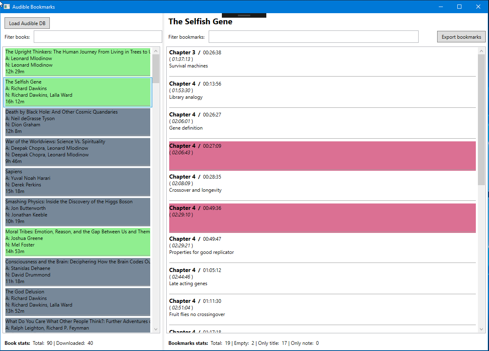

# Audible Bookmarks

Goal of this project is to allow Audible users export bookmark notes from their account (as this is not currently possible by any means).

This is small WPF application capable of loading audible SQLite database and then extracting and computing bookmark related data.

## Requirements to use this app:
* Windows platform
* .Net framework 4.7.1
* Windows 10 Audible UWP app installed
* Books with desired bookmarks has to be downloaded through Win10 Audible app

## Usage:
* Get latest [release](https://github.com/vatioz/AudibleBookmarks/releases) (the zip file) and unzip localy
* Run the AudibleBookmarks.exe
* Click `Load` button and locate Audible database file
  * usually in C:\Users\\\<account name>\AppData\Local\Packages\AudibleInc.AudibleforWindowsPhone_xns73kv1ymhp2\LocalState\library.db
* All your books will be loaded with basic info (left panel)
* Click on the book you want to extract bookmarks from
* All bookmarks for selected book will be loaded (right panel)
  * Items (bookmarks) with red background mean that no title and no note is registered 
* There is statusbar with basic statistics about books and bookmarks at the bottom
* Click `Export bookmarks` button and select location and text file where bookmarks will be saved
* Do this for every book you wish to export bookmarks from
* Books as well as bookmarks can be filtered by simply entering text into filtering text boxes
* Filtering does not affect exporting
* You can change how bookmarks are exported by editing text template - file `BookmarkTemplate.txt`. This template will be used for each bookmark.
  * In the template you can use predefined substitutes (all related to a bookmark)
    * `{Title}` - bookmark title
    * `{Note}` - bookmark note
    * `{ChapterTitle}` - title of the chapter of the bookmark
    * `{PositionChapter}` - time from the begining of the chapter
    * `{PositionOverall}` - time from the begining of the book

## Considerations
As I was testing this app, I came across issues with syncing between my Android Audible app and Windows 10 app. I primarily enter notes through my Android phone. Windows 10 Audible app was always seeing all the bookmarks, but some of them are often empty (no bookmark title nor note) although there definitely is a note on my phone.  
This can be solved by reediting such note on your phone (adding space or dot or something), refreshing library on the phone and then refreshing library on Windows.  
This is why empty bookmarks have red background, those are potentially unsynced bookmarks (and those will not be exported as it makes no sense anyway). 

